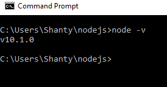

# Lab 1


# 2 Things I Learned in the Form of Quiz Questions

1.  Is the following code synchronous or asynchronous?

    ```js
    fs.readFile('food.txt', 'utf8', function(err, food) {
      if (err) {
        console.log(err);
      } else {
        console.log(food);
      }
    });
    ```

    ## Answer: asynchronous because it uses a callback function

1. 	Is a following code true  ?

       ```js
        node=require('http');
				 ```

 ## Answer: No Because we need to define the variable type.
 # 2 Questions I still have are.

 * what is the role of attribute "request" in the function Method?
 * Where and why we use Node.js?

1.  
